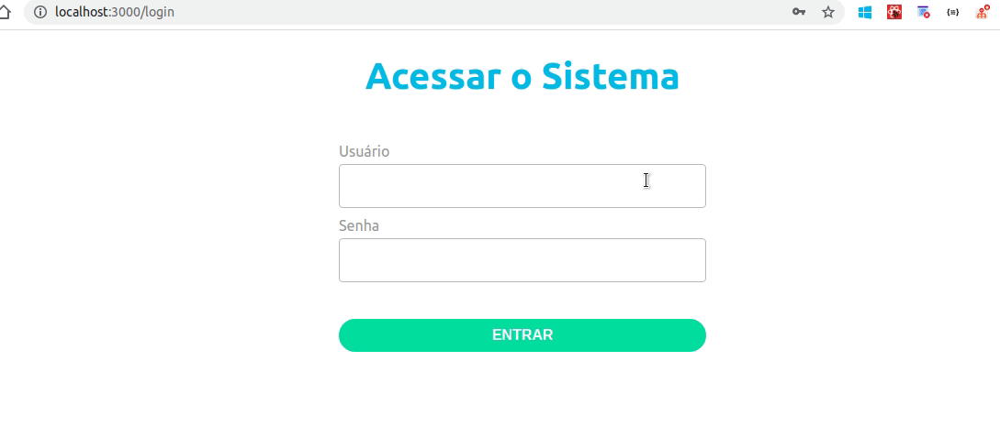

<h1 align="center">
  
</h1>

<h1>
  
</h1>

## 📝 Description

This challenge aims to simulate a mock login page which the user may write a predetermined username and password to enter in "Home" page.

---

## 💻 Used Technologies

This challenge has been made using the following technologies:

- [ReactJS](https://pt-br.reactjs.org/)
- [Context API](https://pt-br.reactjs.org/docs/context.html)
- [React Hooks](https://pt-br.reactjs.org/docs/hooks-intro.html)

---

## 📁 Download

```bash
# Clone the repository
$ git clone https://github.com/jose-renato-m/login-page-challenge.git

# Install dependencies
$ yarn

# Run the application
$ yarn start
```
Obs.: due to the fact that this project simulate a login, a predetermined username and password have to be informed to run the application correctly. Follow them below: <br></br>

- username: admin
- password: admin

---

This challenge has been made with 💙 by José Renato Montagnana 👋🏻 [Keep in Touch!](https://www.linkedin.com/in/joserenato-devfullstack/)